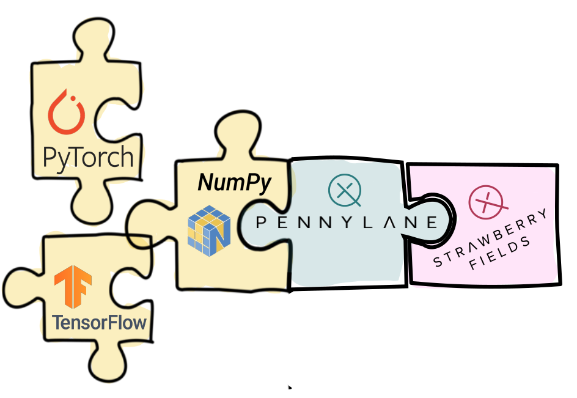

PennyLane-Strawberry Fields Plugin
##################################

:Release: |release|

|

.. include:: ../README.rst
  :start-after:	header-start-inclusion-marker-do-not-remove
  :end-before: header-end-inclusion-marker-do-not-remove

Once the PennyLane-SF plugin is installed, the two provided Strawberry Fields devices can be accessed
straight away in PennyLane, without the need to import any additional packages.

Devices
=======

PennyLane-SF provides two Strawberry Fields devices for PennyLane:

.. devicegalleryitem::
    :name: 'strawberryfields.fock'
    :description: Full simulator that supports all continuous-variable operations.
    :link: devices/fock.html

.. devicegalleryitem::
    :name: 'strawberryfields.gaussian'
    :description: Optimized simulator that supports only Gaussian operations and photon number resolving measurements.
    :link: devices/gaussian.html

.. raw:: html

        

         

.. note::

    The Strawberry Fields plugin only supports :ref:`continuous-variable (CV) operations <intro_ref_ops_cv>`,
    such as :class:`~.pennylane.Squeezing`, or :class:`~.pennylane.NumberOperator`.

Tutorials
=========

To see the PennyLane-SF plugin in action, you can use any of the *continuous-variable* based
`demos from the PennyLane documentation <https://pennylane.ai/qml/demonstrations.html>`_, for example
the tutorial on `Gaussian transformations <https://pennylane.ai/qml/demos/tutorial_gaussian_transformation.html>`_,
and simply replace ``'default.gaussian'`` with any of the available Strawberry Fields devices,
such as ``'strawberryfields.gaussian'``:

.. code-block:: python

    dev = qml.device('strawberryfields.gaussian', wires=XXX)

The ``'strawberryfields.fock'`` device is explicitly used in the
`quantum neural net tutorial <https://pennylane.ai/qml/demos/quantum_neural_net.html>`_.

To filter tutorials that use a StrawberryFields device,
use the "Strawberry Fields" filter on the right panel of the
`demos <https://pennylane.ai/qml/demonstrations.html>`_.

.. toctree::
   :maxdepth: 2
   :titlesonly:
   :hidden:

   installation
   support

.. toctree::
   :maxdepth: 2
   :caption: Usage
   :hidden:

   devices/fock
   devices/gaussian

.. toctree::
   :maxdepth: 1
   :caption: API
   :hidden:

   code
